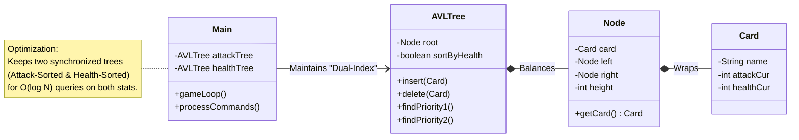

# 🔥 Nightpass: Algorithmic Survival Card Game Engine

> **"Survive the night, master the algorithm."**

**Nightpass** is a high-performance strategy game engine developed in **Java**, solving a resource optimization problem under strict memory and time constraints.

Unlike standard game projects, this engine focuses on **algorithmic efficiency**. It implements a **Custom Self-Balancing AVL Tree** from scratch (instead of using `java.util.HashMap`) to manage game state with **$O(\log N)$** complexity, processing over **550,000 commands** in under **10 seconds**.

## 🚀 Technical Highlights
* **Custom Data Structures:** Built a `Node`-based **AVL Tree** to handle insertions, deletions, and priority searches efficiently without prohibited libraries.
* **Algorithmic Optimization:** Implemented a **Min-Max Priority System** to determine the optimal card to play (Survive & Kill vs. Sacrifice).
* **Automated Testing:** Includes a custom **Python Test Runner** (`test_runner.py`) for regression testing and performance benchmarking.

## 🏗️ System Architecture

The system avoids linear complexity by indexing cards in a balanced tree structure, ensuring rapid retrieval even with large datasets.



## ⚔️ Game Logic (Priority Algorithms)
When The Stranger attacks, the engine executes a deterministic decision tree:

🛡️ Priority 1 (Optimal): Find a card that survives AND kills the enemy.

🛡️ Priority 2 (Defense): Survive and deal maximum damage.

⚔️ Priority 3 (Offense): Sacrifice a card to kill the enemy.

💀 Priority 4 (Mitigation): Sacrifice the weakest card to deal chip damage.

## 🧪 Testing & Benchmarking
This repository includes a Python automation script to verify logic and measure execution time.

**Requirements:** Java 8+ and Python 3.

```bash
# Run regression tests
python3 test_runner.py

# Run performance benchmark (Time Analysis)
python3 test_runner.py --benchmark --verbose

# javac src/*.java
# java -cp src Main testcase_inputs/type1_small.txt output.txt
```
---
*Developed by Melih Efe Sonmez.*
